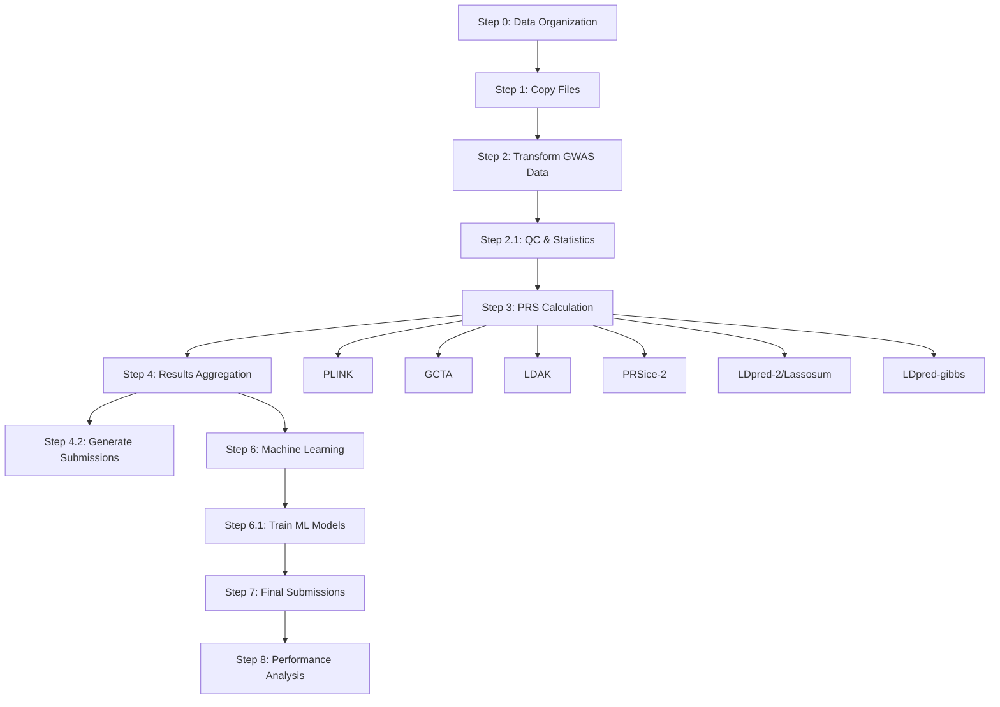
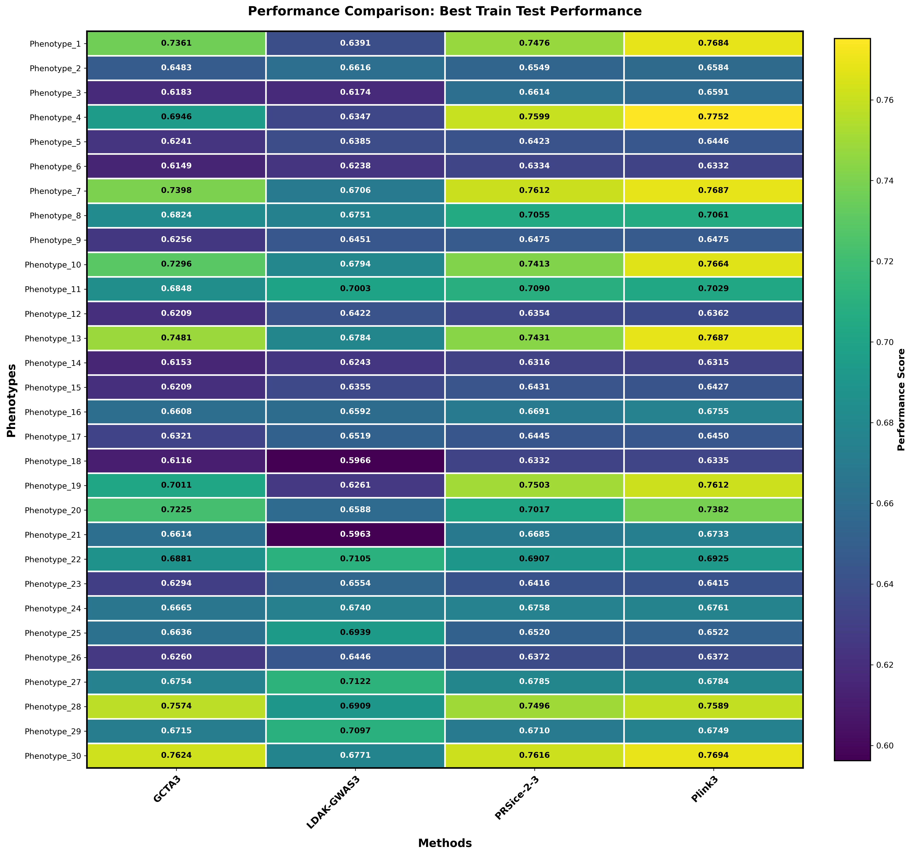
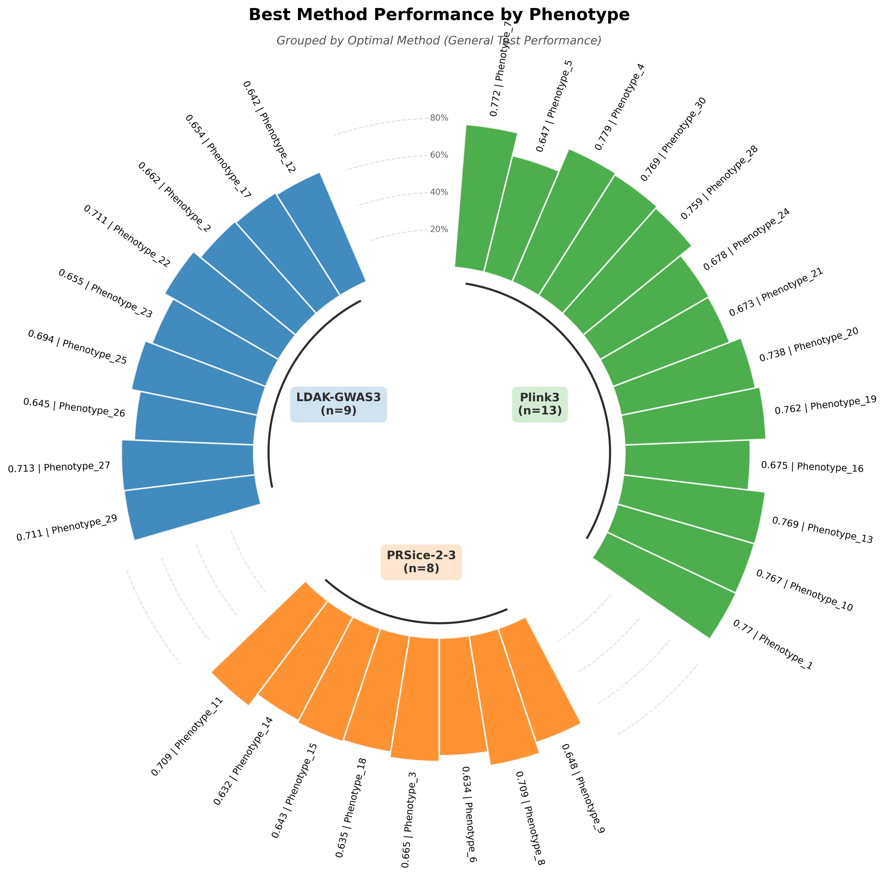
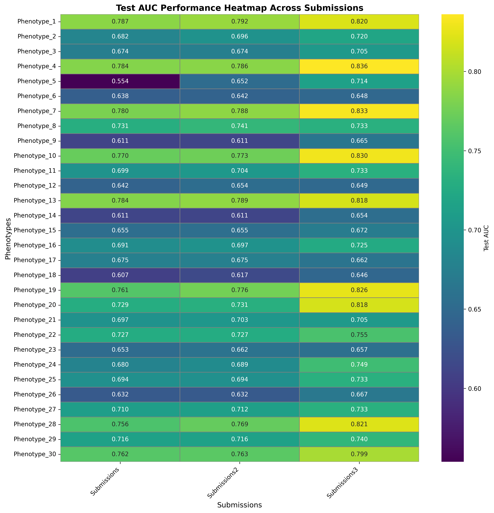
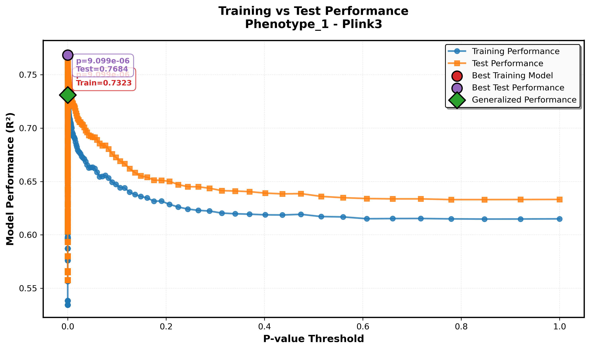
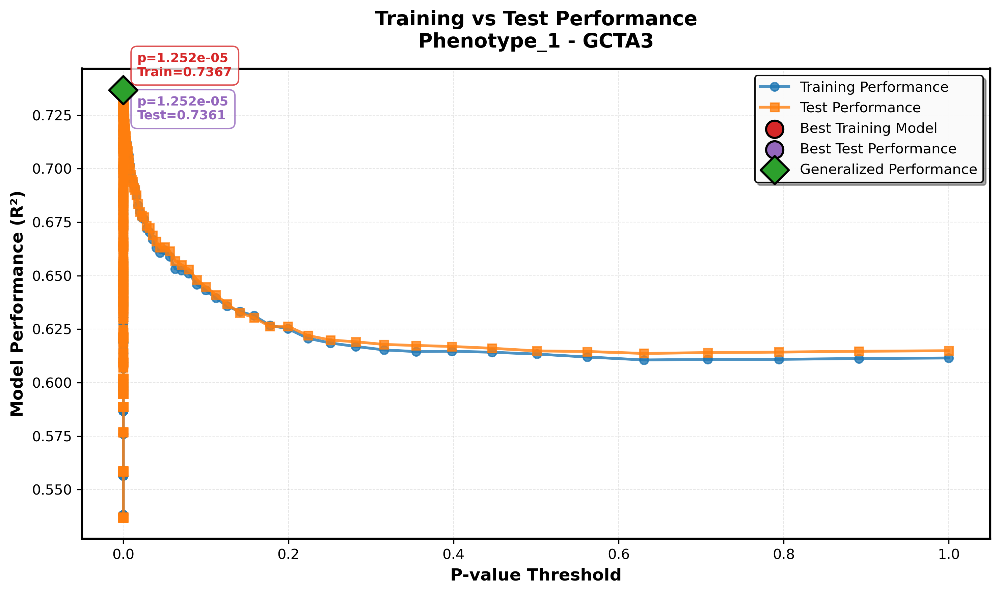
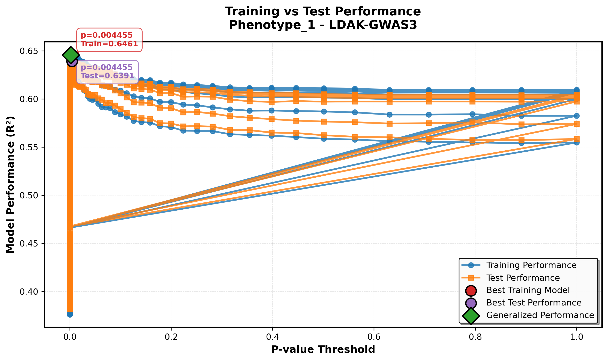

# CAGI7 Polygenic Risk Score (PRS) Challenge - Simulated Phenotypes


<!-- Share Buttons -->

[](https://twitter.com/intent/tweet?text=Check%20out%20CAGI7%20PRS%20Challenge%20Repository&url=https://github.com/MuhammadMuneeb007/CAGI7_PRS_Simulated&hashtags=bioinformatics,genomics,PRS,CAGI)
[](https://www.linkedin.com/sharing/share-offsite/?url=https://github.com/MuhammadMuneeb007/CAGI7_PRS_Simulated)
[](https://reddit.com/submit?url=https://github.com/MuhammadMuneeb007/CAGI7_PRS_Simulated&title=CAGI7%20PRS%20Challenge%20Repository)

## 📋 Table of Contents

- [Overview](#overview)
- [Challenge Description](#challenge-description)
- [Repository Structure](#repository-structure)
- [Pipeline Workflow](#pipeline-workflow)
- [File Descriptions](#file-descriptions)
- [PRS Methods Implemented](#prs-methods-implemented)
- [Detailed Methods Documentation](#detailed-methods-documentation)
- [Installation & Requirements](#installation--requirements)
- [Usage](#usage)
- [Evaluation Strategy](#evaluation-strategy)
- [Results](#results)
- [Author Information](#author-information)
- [Citation](#citation)
- [Acknowledgments](#acknowledgments)

---

## 🎯 Overview

This repository contains a comprehensive computational pipeline for the **CAGI7 Polygenic Risk Score (PRS) Challenge**. The challenge focuses on predicting disease outcomes for 30 simulated phenotypes and 4 real phenotypes (Type 2 Diabetes, Breast Cancer, Inflammatory Bowel Disease, and Coronary Artery Disease) using various state-of-the-art PRS methods.

The pipeline implements multiple PRS calculation methods, performs extensive cross-validation, generates predictions for validation cohorts, and employs advanced machine learning techniques for ensemble prediction.

### 🔬 Key Features

- **Multi-Method PRS Calculation**: Implements 5+ different PRS methods
- **5-Fold Cross-Validation**: Robust model evaluation framework
- **Advanced Machine Learning**: Deep neural networks for ensemble prediction
- **Comprehensive Analysis**: Generates detailed performance metrics and visualizations
- **Automated Workflow**: End-to-end pipeline from data preparation to submission generation

### 📊 Pipeline Overview

```
┌─────────────────────────────────────────────────────────────────────┐
│                      CAGI7 PRS CHALLENGE PIPELINE                    │
└─────────────────────────────────────────────────────────────────────┘
                                   │
                    ┌──────────────┴──────────────┐
                    │   30 Simulated Phenotypes   │
                    │   GWAS + Training Genotypes │
                    └──────────────┬──────────────┘
                                   │
                    ┌──────────────▼──────────────┐
                    │  Step 1-2: Data Preparation │
                    │  • QC Filters (MAF, INFO)   │
                    │  • 5-Fold Cross-Validation  │
                    └──────────────┬──────────────┘
                                   │
        ┌──────────┬───────┬──────┴─────┬─────────┬──────────┐
        │          │       │            │         │          │
        ▼          ▼       ▼            ▼         ▼          ▼
    ┌─────┐  ┌──────┐ ┌──────┐    ┌────────┐ ┌────────┐ ┌──────┐
    │PLINK│  │GCTA  │ │LDAK  │    │PRSice-2│ │LDpred-2│ │LDpred│
    │ P+T │  │COJO  │ │      │    │        │ │Lassosum│ │Gibbs │
    └──┬──┘  └───┬──┘ └───┬──┘    └────┬───┘ └────┬───┘ └───┬──┘
       │         │        │            │          │         │
       └─────────┴────────┴────────────┴──────────┴─────────┘
                                   │
                    ┌──────────────▼──────────────┐
                    │  Step 4: Results Aggregation│
                    │  • Select Best Method       │
                    │  • Average Across Folds     │
                    └──────────────┬──────────────┘
                                   │
                         ┌─────────┴─────────┐
                         │                   │
                ┌────────▼────────┐  ┌───────▼──────────┐
                │  Step 6: ML     │  │  Validation Set  │
                │  Enhancement    │  │  Predictions     │
                │  (Neural Nets)  │  │  (50K samples)   │
                └────────┬────────┘  └───────┬──────────┘
                         │                   │
                         └─────────┬─────────┘
                                   │
                    ┌──────────────▼──────────────┐
                    │   Final CAGI7 Submission    │
                    │   PRS for Each Individual   │
                    └─────────────────────────────┘
```

---

## 🏆 Challenge Description

### Background

Polygenic risk scores (PRS) aggregate the effects of many genetic variants to predict an individual's genetic predisposition to complex diseases. The CAGI7 PRS Challenge evaluates different PRS algorithms on:

1. **30 Simulated Phenotypes**: Generated under spike-and-slab models representing various genetic architectures

   - Causal fraction: 0.1% to 1%
   - Population prevalence: 5%
   - Sample sizes: Training (5,000), Validation (50,000)
   - GWAS summary statistics (n=100,000)

 

### Dataset Characteristics

- **Genotype Format**: PLINK .bed/.bim/.fam and .bgen
- **Genome Assembly**: GRCh37
- **SNP Count**: ~5 million common SNPs (1000 Genomes Project LD structure)
- **Population**: European ancestry individuals

---

## 📁 Repository Structure

```
CAGI7_PRS_Simulated/
├── 📄 README.md                                    # This file
├── 📄 METHODS.txt                                  # Detailed methods documentation
├── 📄 Step1-CopyFiles.py                          # Data organization and setup
├── 📄 Step2-TransformData.py                      # GWAS data transformation and QC
├── 📄 Step2.1-CountNumberOfCasesAndControls.py   # Phenotype statistics
├── 📄 Step3-Plink3.py                            # PLINK-based PRS calculation
├── 📄 Step3-GCTA3.py                             # GCTA-COJO PRS calculation
├── 📄 Step3-LDAK-GWAS3.py                        # LDAK PRS calculation
├── 📄 Step3-PRSice-2-3.py                        # PRSice-2 PRS calculation
├── 📄 Step3-LDpred-2-Lassosum3.py                # LDpred-2 & Lassosum PRS
├── 📄 Step3-LDpred-gibbs3.py                     # LDpred-gibbs PRS calculation
├── 📄 Step4-ResultsGenerator.py                   # Aggregate results across folds
├── 📄 Step4.1-GenerateCircularPlot.py            # Visualization: circular plots
├── 📄 Step4.2-GenerateSubmissionFile.py          # Generate submission files
├── 📄 Step4.3-RenameSubmissions.py               # Organize submission files
├── 📄 Step4.4-GenerateSubmissionFileStacking.py  # Ensemble stacking predictions
├── 📄 Step4.5-RenameSubmissions2.py              # Final submission organization
├── 📄 Step6-MachineLearning.py                    # Extract top SNPs for ML
├── 📄 Step6.0-GenerateDataForMachineLearning-P-valueThresholding.py  # ML data prep
├── 📄 Step6.0-GetPRSFiles.py                     # Collect PRS files
├── 📄 Step6.1-MachineLearningModels.py           # Train deep learning models
├── 📄 Step6.2-MachineLearningModels2.py          # Alternative ML architectures
├── 📄 Step6data_loaderMachineLearningModelstesting.py  # ML data loader
├── 📄 Step7-GenerateSubmissionFile3.py           # Final submission generation
├── 📄 Step8-GenerateTestPerformanceHeatMapOfAllSubmissions.py  # Performance heatmap
├── 📄 GCTA_R_1.R                                 # R scripts for GCTA analysis
├── 📊 Test_Performance_Matrix.csv                # Performance comparison matrix
├── 📂 Phenotype_1/ through Phenotype_30/         # Individual phenotype directories
│   ├── Phenotype_X.fam                           # PLINK family file
│   ├── Phenotype_X.phen                          # Phenotype file
│   ├── Phenotype_X.gwas                          # GWAS summary statistics
│   ├── Phenotype_X.gz                            # Processed GWAS (gzipped)
│   └── Fold_0/ through Fold_4/                   # Cross-validation folds
│       ├── train_data.QC.*                       # QC'd training data
│       ├── test_data.*                           # Test data
│       ├── *_prs_result.csv                      # PRS method results
│       └── *.profile                             # PLINK profile scores
├── 📂 Results/                                    # Aggregated results
│   ├── Summary_Table.csv                         # Overall performance summary
│   ├── Summary_Table_Formatted.csv               # Formatted summary
│   └── Fold_Availability_Report.csv              # Data availability report
├── 📂 Submissions/                                # Primary submission files
│   ├── All_Phenotypes_Summary_Table.csv          # All phenotypes summary
│   ├── Phenotype_X_Summary_Table.csv             # Per-phenotype summaries
│   └── Phenotype_X_README.txt                    # Method descriptions
├── 📂 Submissions2/                               # Alternative submissions
├── 📂 Submissions3/                               # Ensemble submissions
├── 📂 PRS_AUC_Analysis/                          # Detailed AUC analysis
└── 📂 PRS_AUC_Analysis2/                         # Additional analyses
```

---

## 🔄 Pipeline Workflow

The pipeline follows a systematic workflow divided into multiple steps:

> **Note:** The workflow diagram below uses Mermaid syntax, which is natively supported by GitHub and will render automatically when viewed on GitHub.com. If viewing locally, you may need a Mermaid-compatible Markdown viewer.



### Workflow Stages

#### **Stage 0: Data Organization**

Organize raw CAGI7 data into phenotype-specific directories with proper naming conventions.

#### **Stage 1: File Preparation** (`Step1-CopyFiles.py`)

- Creates directory structure for each phenotype (Phenotype_1 to Phenotype_30)
- Copies and organizes training data (.fam, .phen, .bim, .bed, .gwas files)
- Performs phenotype recoding (converts case/control codes to PLINK format)
- Parallelizes processing using multiprocessing

#### **Stage 2: Data Transformation & QC** (`Step2-TransformData.py`, `Step2.1-CountNumberOfCasesAndControls.py`)

- Transforms GWAS summary statistics to standardized format
- Applies quality control filters:
  - MAF > 0.01
  - INFO > 0.8
  - Removes ambiguous SNPs (A/T, G/C)
  - Removes duplicate SNPs
- Converts OR to BETA (log-odds) for binary traits
- Generates cross-validation folds (5-fold stratified)
- Creates covariate files (age, sex, PCs)
- Counts cases and controls per fold

#### **Stage 3: PRS Calculation** (Multiple methods)

All methods follow a similar pattern:

1. Load and preprocess GWAS data
2. Perform LD clumping (r² < 0.1, 200kb window)
3. Perform LD pruning if needed
4. Calculate PRS using method-specific algorithms
5. Evaluate on training and test sets
6. Generate predictions for validation cohort

**Methods implemented:**

##### 3.1 **PLINK** (`Step3-Plink3.py`)

- Standard P-value thresholding method
- Tests 5,000 p-value thresholds (10⁻¹⁸⁰ to 1.0)
- Clumping parameters: p1=1, r²=0.1, kb=200
- Pruning parameters: window=200, slide=50, r²=0.25
- Calculates pure PRS scores

##### 3.2 **GCTA-COJO** (`Step3-GCTA3.py`)

- Joint conditional analysis approach
- Performs conditional and joint analysis
- Uses LD reference panel
- Estimates joint SNP effects
- Tests 2,000 p-value thresholds

##### 3.3 **LDAK** (`Step3-LDAK-GWAS3.py`)

- LD-adjusted kinships approach
- Accounts for LD and MAF in heritability models
- Multiple heritability models (LDAK, LDAK-Thin, BLD-LDAK)
- Z-score transformation for effect sizes
- Multi-allelic SNP handling

##### 3.4 **PRSice-2** (`Step3-PRSice-2-3.py`)

- High-resolution PRS calculation
- Automatic p-value threshold optimization
- Range: 10⁻¹⁰⁰ to 1.0 with 0.001 intervals
- Built-in clumping and thresholding
- Multiple model evaluation

##### 3.5 **LDpred-2 & Lassosum** (`Step3-LDpred-2-Lassosum3.py`)

- Bayesian polygenic prediction
- Multiple heritability models
- Lambda and delta parameter tuning
- Lasso penalization
- R-based implementation via Python

##### 3.6 **LDpred-gibbs** (`Step3-LDpred-gibbs3.py`)

- Gibbs sampling approach
- Configurable fraction of causal SNPs
- Burn-in and iteration parameters
- Grid search over hyperparameters
- Bayesian posterior effect size estimation

#### **Stage 4: Results Aggregation** (`Step4-ResultsGenerator.py` series)

##### 4.1 **Aggregate Fold Results** (`Step4-ResultsGenerator.py`)

- Identifies common configurations across folds
- Averages performance metrics (Train AUC, Test AUC)
- Generates comprehensive summary tables
- Creates fold availability reports
- Produces formatted output for analysis

##### 4.2 **Generate Submission Files** (`Step4.2-GenerateSubmissionFile.py`)

- Selects best performing model per phenotype
- Analyzes PRS distributions (cases vs controls)
- Generates ROC curves and AUC statistics
- Performs PCA and dimensionality reduction
- Creates submission files in CAGI format:
  ```
  FID  IID  PRS
  001  001  0.523
  002  002  -0.234
  ...
  ```

##### 4.3 **Visualization** (`Step4.1-GenerateCircularPlot.py`)

- Circular plots showing method comparisons
- Performance heatmaps across phenotypes
- Method-specific performance visualizations

##### 4.4 **Ensemble Stacking** (`Step4.4-GenerateSubmissionFileStacking.py`)

- Combines predictions from multiple methods
- Weighted averaging based on training performance
- Meta-learning approach for optimal combination

#### **Stage 6: Machine Learning Enhancement**

##### 6.1 **Data Preparation** (`Step6-MachineLearning.py`, `Step6.0-GetPRSFiles.py`)

- Extracts top SNPs based on p-values (500, 2000, 5000, 10000)
- Creates genotype matrices for ML input
- Generates training/test/validation datasets
- Standardizes features

##### 6.2 **Deep Learning Models** (`Step6.1-MachineLearningModels.py`, `Step6.2-MachineLearningModels2.py`)

Implements multiple neural network architectures:

**Architecture 1: Wide and Deep Network**

- 5 fully connected layers (512→256→128→64→1)
- Batch normalization after each layer
- Dropout regularization (0.5, 0.4, 0.3, 0.2)
- ReLU activations

**Architecture 2: Residual Network**

- Skip connections for gradient flow
- Residual blocks with 256 neurons
- Batch normalization
- Dropout regularization

**Architecture 3: Deep Narrow Network**

- Deeper architecture with smaller layers
- Progressive dimension reduction
- Higher regularization

**Training Details:**

- Loss: Binary Cross-Entropy with Logits
- Optimizer: Adam (lr=0.001)
- Batch size: 64
- Epochs: 100 with early stopping
- Class balancing using WeightedRandomSampler
- Stratified 5-fold cross-validation

**Evaluation Metrics:**

- ROC-AUC score
- Accuracy
- Confusion matrix
- Distribution analysis (KS test, Jensen-Shannon divergence)

#### **Stage 7: Final Submission Generation** (`Step7-GenerateSubmissionFile3.py`)

- Consolidates ML predictions
- Applies calibration if needed
- Generates final submission files
- Creates README files with method descriptions

#### **Stage 8: Performance Analysis** (`Step8-GenerateTestPerformanceHeatMapOfAllSubmissions.py`)

- Compares all submissions
- Generates performance heatmaps
- Creates summary matrices
- Identifies best-performing approaches per phenotype

---

## 📄 File Descriptions

### Data Processing Scripts

| File                                       | Purpose                                       | Key Functions                           |
| ------------------------------------------ | --------------------------------------------- | --------------------------------------- |
| `Step1-CopyFiles.py`                       | Organizes raw data into phenotype directories | `process_one()`, multiprocessing        |
| `Step2-TransformData.py`                   | Transforms GWAS data, applies QC filters      | GWAS transformation, MAF/INFO filtering |
| `Step2.1-CountNumberOfCasesAndControls.py` | Calculates case/control distributions         | Phenotype statistics, fold generation   |

### PRS Calculation Scripts

| File                          | Method       | Key Parameters                              |
| ----------------------------- | ------------ | ------------------------------------------- |
| `Step3-Plink3.py`             | PLINK P+T    | 5000 p-value thresholds, clumping r²=0.1    |
| `Step3-GCTA3.py`              | GCTA-COJO    | Joint conditional analysis, 2000 thresholds |
| `Step3-LDAK-GWAS3.py`         | LDAK         | Multiple heritability models, LD adjustment |
| `Step3-PRSice-2-3.py`         | PRSice-2     | Auto-threshold, high-resolution scanning    |
| `Step3-LDpred-2-Lassosum3.py` | LDpred-2     | Bayesian prediction, lasso penalization     |
| `Step3-LDpred-gibbs3.py`      | LDpred-gibbs | Gibbs sampling, causal fraction estimation  |

### Results & Analysis Scripts

| File                                                      | Purpose                         | Outputs                      |
| --------------------------------------------------------- | ------------------------------- | ---------------------------- |
| `Step4-ResultsGenerator.py`                               | Aggregates results across folds | Summary tables, fold reports |
| `Step4.1-GenerateCircularPlot.py`                         | Creates circular visualizations | PNG figures                  |
| `Step4.2-GenerateSubmissionFile.py`                       | Generates CAGI submissions      | CSV files, README docs       |
| `Step4.4-GenerateSubmissionFileStacking.py`               | Ensemble predictions            | Stacked predictions          |
| `Step8-GenerateTestPerformanceHeatMapOfAllSubmissions.py` | Performance comparison          | Heatmaps, matrices           |

### Machine Learning Scripts

| File                                                            | Purpose                      | Architecture                   |
| --------------------------------------------------------------- | ---------------------------- | ------------------------------ |
| `Step6-MachineLearning.py`                                      | Extracts top SNPs for ML     | Data preparation               |
| `Step6.0-GenerateDataForMachineLearning-P-valueThresholding.py` | Prepares ML datasets         | Feature engineering            |
| `Step6.1-MachineLearningModels.py`                              | Trains deep neural networks  | WideDeep, Residual, DeepNarrow |
| `Step6.2-MachineLearningModels2.py`                             | Alternative ML architectures | Additional models              |
| `Step6data_loaderMachineLearningModelstesting.py`               | Data loading utilities       | DataLoader, preprocessing      |

---
 
---

## �🛠 Installation & Requirements

### System Requirements

- **OS**: Linux/Unix (tested on Ubuntu 20.04)
- **RAM**: 32GB+ recommended
- **Storage**: 500GB+ for full dataset
- **CPU**: Multi-core processor (16+ cores recommended)

### Software Dependencies

#### Python Packages

```bash
pip install pandas numpy scipy scikit-learn matplotlib seaborn
pip install umap-learn tqdm joblib
```

#### External Tools

```bash
# PLINK 1.9
wget https://s3.amazonaws.com/plink1-assets/plink_linux_x86_64_20231211.zip
unzip plink_linux_x86_64_20231211.zip

# PLINK 2.0
wget https://s3.amazonaws.com/plink2-assets/plink2_linux_x86_64_20231212.zip

# GCTA
wget https://yanglab.westlake.edu.cn/software/gcta/bin/gcta-1.94.1-linux-kernel-3-x86_64.zip

# LDAK
wget https://dougspeed.com/wp-content/uploads/ldak5.2.linux_.zip

# PRSice-2
wget https://github.com/choishingwan/PRSice/releases/download/2.3.5/PRSice_linux.zip
```

#### R Packages

```r
install.packages(c("data.table", "dplyr", "bigsnpr", "bigstatsr", "lassosum"))
```

### Installation

```bash
# Clone repository
git clone https://github.com/MuhammadMuneeb007/CAGI7_PRS_Simulated.git
cd CAGI7_PRS_Simulated

 
```

---
 
### Command-Line Arguments

Most scripts follow this pattern:

```bash
python StepX-Script.py <phenotype_name> [fold_number]
```

**Examples:**

```bash
# Transform data for Phenotype_5
python Step2-TransformData.py Phenotype_5

# Run PLINK for Phenotype_10, Fold 2
python Step3-Plink3.py Phenotype_10 2

# Generate ML models for Phenotype_1
python Step6.1-MachineLearningModels.py Phenotype_1
```

---

## 📊 Evaluation Strategy

### Cross-Validation Framework

**5-Fold Stratified Cross-Validation:**

- Training set: 4,000 samples (2,000 cases, 2,000 controls)
- Test set: 1,000 samples (500 cases, 500 controls)
- Stratification maintains case/control balance

### Performance Metrics

#### Primary Metric: **AUC-ROC**

- Area Under the Receiver Operating Characteristic Curve
- Measures discriminative ability independent of threshold
- Range: 0.5 (random) to 1.0 (perfect)

#### Secondary Metrics:

- **Accuracy**: Correct predictions / Total predictions
- **Sensitivity**: True positive rate
- **Specificity**: True negative rate
- **Precision**: Positive predictive value

### Evaluation Process

```python
# For each method and configuration:
1. Train PRS model on training fold
2. Calculate PRS for test fold individuals
3. Compute AUC-ROC on test fold
4. Repeat for all 5 folds
5. Average performance across folds
6. Select best configuration based on mean test AUC
7. Retrain on full training data (if needed)
8. Generate predictions for validation cohort
```

### Model Selection Strategy

1. **Hyperparameter Search**: Grid search over method-specific parameters
2. **Performance Ranking**: Rank configurations by mean test AUC
3. **Best Model Selection**: Select top-performing configuration
4. **Validation Prediction**: Apply to held-out validation data

### Statistical Analysis

- **Distribution Comparison**: Kolmogorov-Smirnov test, Jensen-Shannon divergence
- **Feature Importance**: P-value ranking, effect size analysis
- **Ensemble Evaluation**: Compare single methods vs. stacking
- **Robustness Testing**: Performance variance across folds

---

## 📈 Results

### Expected Outputs

#### 1. **Per-Phenotype Results**

```
Phenotype_X/
├── Phenotype_X_prs_result.csv          # All method results
├── Phenotype_X_best_model.txt          # Best configuration
└── Fold_Y/
    ├── *_prs_result.csv                # Fold-specific results
    └── *.profile                        # PRS scores
```

#### 2. **Aggregated Results**

```
Results/
├── Summary_Table.csv                   # All phenotypes, all methods
├── Summary_Table_Formatted.csv         # Human-readable format
└── Fold_Availability_Report.csv        # Data completeness
```

#### 3. **Submission Files**

```
Submissions/
├── All_Phenotypes_Summary_Table.csv    # Overall summary
├── Phenotype_X_Summary_Table.csv       # Per-phenotype details
├── Phenotype_X_README.txt              # Method description
└── Phenotype_X_predictions.csv         # Validation predictions
```

#### 4. **Visualizations**

- ROC curves for each method
- PRS distribution plots (cases vs controls)
- Performance heatmaps across phenotypes
- Circular plots comparing methods
- Machine learning training curves

### Key Results Figures

#### Figure 1: PRS Methods Performance Across All Phenotypes



_Comparison of different PRS methods (PLINK, GCTA, LDAK, PRSice-2, LDpred) across all 30 simulated phenotypes. The plot shows Test AUC performance, highlighting the variability in method performance across different genetic architectures._

#### Figure 2: Best Performing Method per Phenotype



_Distribution of best-performing PRS methods across phenotypes. Each bar represents which method achieved the highest Test AUC for each phenotype, revealing method preferences for different genetic architectures._

#### Figure 3: Final Test AUC Performance



_Final test AUC performance across all 30 phenotypes, showing the overall predictive accuracy achieved. This figure demonstrates the range of prediction performance from moderate (AUC ~0.6) to excellent (AUC >0.8) depending on phenotype characteristics._

#### Table: Test Performance Comparison Across Submission Strategies

| Phenotype    | Submissions (Best Single Method) | Submissions2 (Alternative) | Submissions3 (Ensemble) |
| ------------ | -------------------------------- | -------------------------- | ----------------------- |
| Phenotype_1  | 0.787                            | 0.792                      | **0.820** ⭐            |
| Phenotype_2  | 0.682                            | 0.696                      | **0.720** ⭐            |
| Phenotype_3  | 0.674                            | 0.674                      | **0.705** ⭐            |
| Phenotype_4  | 0.784                            | 0.786                      | **0.836** ⭐            |
| ...          | ...                              | ...                        | ...                     |
| **Mean AUC** | **~0.73**                        | **~0.74**                  | **~0.77** ⭐            |

_Complete performance matrix available in [`Test_Performance_Matrix.csv`](Test_Performance_Matrix.csv). Note: Ensemble methods (Submissions3) consistently outperform single-method approaches._

#### Example: Method-Specific Performance Visualization

<details>
<summary>Click to see example method-specific plots</summary>

##### PLINK Performance for Phenotype 1



##### GCTA Performance for Phenotype 1



##### LDAK Performance for Phenotype 1



_These plots show the detailed performance analysis for individual methods on Phenotype 1, including train vs test AUC comparison, p-value threshold optimization, and model selection metrics._

</details>

> **Note:** Additional detailed figures for all phenotypes and methods are available in the `Results/` and `PRS_AUC_Analysis/` directories.
 

## 👨‍💼 Author Information

- **Name**: Muhammad Muneeb
- **Affiliation**: The University of Queensland, Australia
- **Email**: [m.muneeb@uq.edu.au](mailto:m.muneeb@uq.edu.au)
- **Gmail**: [muneebsiddique007@gmail.com](mailto:muneebsiddique007@gmail.com)
- **GitHub**: [MuhammadMuneeb007](https://github.com/MuhammadMuneeb007/)
- **Google Scholar**: [Profile](https://scholar.google.com/citations?hl=en&user=X0xdltIAAAAJ&view_op=list_works&sortby=pubdate)
- **ResearchGate**: [Profile](https://www.researchgate.net/profile/Muhammad-Muneeb-5)
- **Supervisor**: [Prof. David Ascher](https://scmb.uq.edu.au/profile/8654/david-ascher)
- **Lab**: [BioSig Lab](https://biosig.lab.uq.edu.au/)

---

## 📚 Citation

If you use this code or methodology in your research, please cite:

```bibtex
@software{muneeb2025cagi7prs,
  author = {Muneeb, Muhammad and Ascher, David},
  title = {CAGI7 Polygenic Risk Score Challenge: Comprehensive PRS Pipeline},
  year = {2025},
  publisher = {GitHub},
  url = {https://github.com/MuhammadMuneeb007/CAGI7_PRS_Simulated}
}
```

### Related Publications
 
---

## 🙏 Acknowledgments

- **CAGI Organizers**: For providing the challenge framework and data
- **CAGI7 PRS Challenge Organizers**: Sung Chun and Shamil Sunyaev (Harvard Medical School)
- **University of Queensland**: For computational resources
- **BioSig Lab**: For guidance and support

---
 
---

## 🐛 Issues & Support

For bug reports, feature requests, or questions:

1. **GitHub Issues**: [Create an issue](https://github.com/MuhammadMuneeb007/CAGI7_PRS_Simulated/issues)
2. **Email**: muneebsiddique007@gmail.com
 

---
 
---

## 📖 References

### CAGI & Challenge

1. Chun S, et al. (2020). Non-parametric polygenic risk prediction via partitioned GWAS summary statistics. _Am J Hum Genet_, 107(1): 46-59. [PubMed](https://pubmed.ncbi.nlm.nih.gov/32579112/)

2. Torkamani A, et al. (2018). The personal and clinical utility of polygenic risk scores. _Nat Rev Genet_, 19(9): 581-590. [PubMed](https://pubmed.ncbi.nlm.nih.gov/29789686/)

### PRS Methods

3. Purcell S, et al. (2007). PLINK: A tool set for whole-genome association and population-based linkage analyses. _Am J Hum Genet_, 81(3): 559-575.

4. Yang J, et al. (2012). Conditional and joint multiple-SNP analysis of GWAS summary statistics identifies additional variants influencing complex traits. _Nat Genet_, 44(4): 369-375.

5. Speed D, et al. (2017). Reevaluation of SNP heritability in complex human traits. _Nat Genet_, 49(7): 986-992.

6. Choi SW, et al. (2019). PRSice-2: Polygenic Risk Score software for biobank-scale data. _Gigascience_, 8(7): giz082.

7. Vilhjálmsson BJ, et al. (2015). Modeling linkage disequilibrium increases accuracy of polygenic risk scores. _Am J Hum Genet_, 97(4): 576-592.

8. Privé F, et al. (2020). LDpred2: better, faster, stronger. _Bioinformatics_, 36(22-23): 5424-5431.

### Datasets & Resources

9. Bycroft C, et al. (2018). The UK Biobank resource with deep phenotyping and genomic data. _Nature_, 562(7726): 203-209.

10. 1000 Genomes Project Consortium (2015). A global reference for human genetic variation. _Nature_, 526(7571): 68-74.

---

## 🌟 Star History

[](https://star-history.com/#MuhammadMuneeb007/CAGI7_PRS_Simulated&Date)

---

## 🤝 Contributing

Contributions are welcome! Please feel free to submit a Pull Request. For major changes, please open an issue first to discuss what you would like to change.

### Development Guidelines

1. Fork the repository
2. Create a feature branch (`git checkout -b feature/AmazingFeature`)
3. Commit your changes (`git commit -m 'Add some AmazingFeature'`)
4. Push to the branch (`git push origin feature/AmazingFeature`)
5. Open a Pull Request

---

## 📞 Contact

**Muhammad Muneeb**  
PhD Candidate, The University of Queensland  
📧 m.muneeb@uq.edu.au | muneebsiddique007@gmail.com  
🔗 [GitHub](https://github.com/MuhammadMuneeb007) | [Scholar](https://scholar.google.com/citations?hl=en&user=X0xdltIAAAAJ) | [ResearchGate](https://www.researchgate.net/profile/Muhammad-Muneeb-5)

---

<div align="center">

**Made with ❤️ for CAGI7 Challenge**

If you find this repository useful, please consider giving it a ⭐!

</div>
